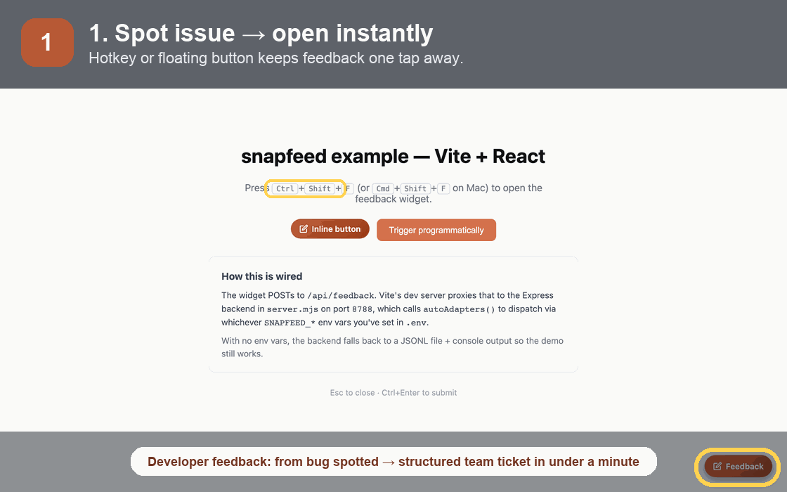
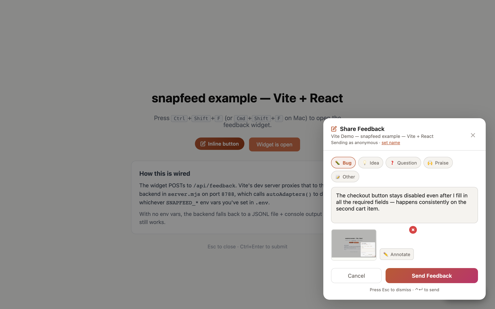
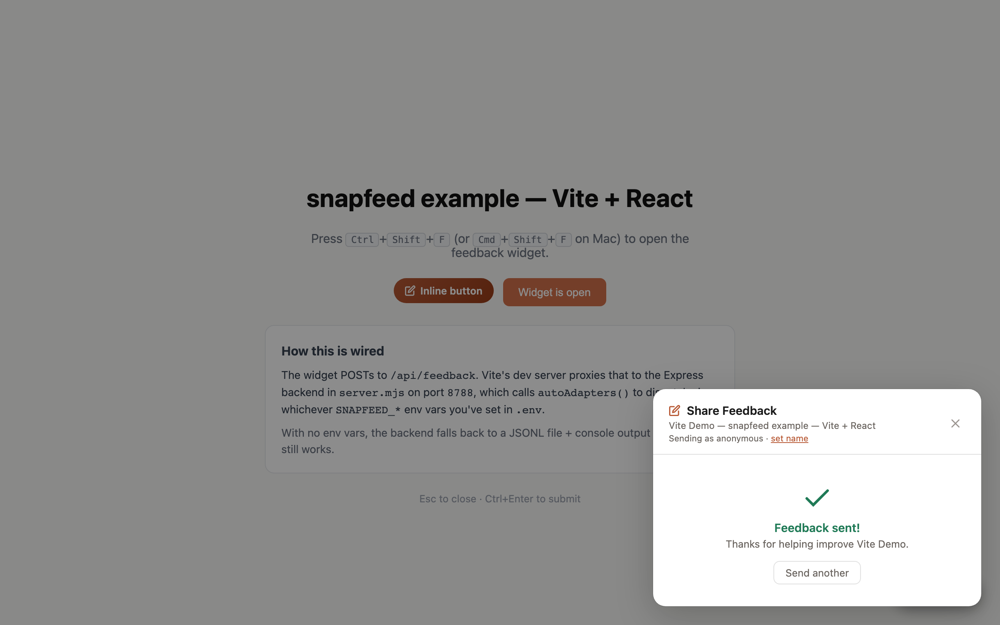

# snapfeed

> Agent-ready feedback loops for internal dogfooding. See it → report it → route it → fix it.

[](https://www.npmjs.com/package/snapfeed)
[](./LICENSE)
[](https://github.com/shimoverse/snapfeed/actions)
[](#)

snapfeed is a feedback capture layer for teams where humans and agents both review software. A tester, designer, PM agent, QA agent, or design-review agent spots something in the product, opens the widget, sends one sentence, and snapfeed turns that moment into structured feedback with screenshot, URL, viewport, console errors, reporter identity, and build context.

Use it as the intake pipe for an agentic product loop: review agent finds the issue, snapfeed routes the payload, your orchestrator wakes the right coding agent, and the fix can move into test and deployment. Humans can use the same widget, but the architecture assumes the next reviewer might be Hermes, OpenClaw, Codex, Claude Code, OpenCode, a PM agent, or a QA/design agent.

Not an end-customer feedback widget. If you want a public "tell us what you think" form, use Canny. If you want your team and agents to file high-context bugs while they test — keep reading.



> The story is bigger than filing a ticket: a human or agent reviewer spots an issue, snapfeed captures the context, your orchestrator routes it to the right coding agent, and the fix can move through test, PR, and deployment.

## Pick your mode

| Mode | For | Setup |
|------|-----|-------|
| 🚀 Cloud-relayed | Indie / hackathon / small startup | 5 min |
| 🏢 Self-hosted | Startup → mid-size | 30 min |
| 🔒 Air-gapped | Corp / regulated | 1-2 weeks (incl. security review) |

Same widget. Different backend topology. Pick based on what your IT will approve.

**New here? Choose one path:**

1. **Try it locally:** run the 60-second quickstart below; feedback lands in `feedback.jsonl`.
2. **Wire your team:** add one server-side destination such as Slack, GitHub, Linear, JIRA, or webhook.
3. **Ship it safely:** follow the [production checklist](./docs/PRODUCTION_CHECKLIST.md) before enabling the widget beyond local/staging.

**Per-persona quickstart guides** (5 min → 1 hour, copy-paste runnable): see [docs/quickstart/](./docs/quickstart/index.md) for indie, startup, mid-size, corp, OSS-maintainer, and designer walkthroughs.

## Agent-ready feedback loops

Most feedback tools assume a human PM reads the ticket later. snapfeed assumes you may already have a full agent architecture:

| Reviewer | What they inspect | Where snapfeed sends it |
|---|---|---|
| QA agent | broken flows, failed checks, regressions | GitHub Issue, Linear/JIRA bug, webhook to orchestrator |
| Design agent | layout, copy, accessibility, visual diffs | Slack/design channel, design QA queue, webhook |
| PM agent | acceptance criteria, launch blockers, prioritization | roadmap board, issue tracker, triage inbox |
| Human tester/designer | anything that feels wrong in the actual product | the same route, same payload, same audit trail |

The usual loop looks like this:

```text
reviewer agent or human
  → snapfeed widget / feedback API
  → /api/feedback with screenshot + URL + metadata + target element context
  → Slack/JIRA/Linear/GitHub/webhook
  → orchestrator assigns coding agent
  → fix PR → tests → deployment
```

snapfeed is not the orchestrator and does not auto-deploy by itself. It is the structured feedback handoff. Point `webhookAdapter` at Hermes, OpenClaw, your queue, or your own orchestration layer when you want feedback to trigger an agent run.

### Element context for coding agents

When `collectElementContext` is enabled (default), snapfeed remembers the last host-app element the reviewer clicked or focused before opening the widget. The submitted `FeedbackPayload` includes a bounded `target` object with a selector, DOM path, tag, ARIA label, visible text, component hint from `data-component` / `data-snapfeed-component`, viewport bounds, and a small computed-style snapshot. snapfeed-owned UI is marked with `data-snapfeed-ui` and ignored, so pressing Send does not replace the original app target.

This is the Agentation-style precision layer inside snapfeed's broader workflow: agents get enough detail to grep or inspect the exact UI element, while snapfeed still routes the feedback to Slack, GitHub, Linear, JIRA, Supabase, or your orchestrator. GitHub and Slack destinations show the target selector; Supabase stores it under `metadata.target`; webhooks receive the full payload.

```json
{
  "text": "Button copy feels risky",
  "pageUrl": "https://staging.example.com/checkout",
  "target": {
    "tagName": "button",
    "selector": "[data-testid=\"pay-now\"]",
    "domPath": "body > main > button.primary",
    "componentName": "CheckoutButton",
    "ariaLabel": "Pay now",
    "text": "Pay now"
  }
}
```

Disable it for privacy-sensitive surfaces with `<FeedbackProvider collectElementContext={false}>` or override `payload.target` when submitting programmatically.

### Agent install and verification checklist

If you are an AI coding agent adding snapfeed to a repo, do this in order:

1. Read [`AGENTS.md`](./AGENTS.md) for the deterministic install path.
2. Run `npm install snapfeed` and `npx snapfeed init --yes`.
3. Mount `<FeedbackProvider>` in the app root and pass authenticated `user` data if available.
4. Configure one destination. For an agent loop, use `SNAPFEED_WEBHOOK_URL` or a custom adapter that posts to your orchestrator.
5. Run `npx snapfeed doctor`, then `npx snapfeed doctor --prod` before enabling production.
6. Smoke test the handler:

```bash
curl -X POST http://localhost:3000/api/feedback \
  -H 'Content-Type: application/json' \
  -d '{"text":"agent smoke test","appName":"MyApp","pageUrl":"http://localhost:3000","pageName":"Home","timestamp":"2026-04-26T12:00:00Z"}'
```

Success means the app accepted structured feedback. A real message/ticket/webhook delivery means your routing works. For production, verify the destination payload reaches the agent queue and that your coding agent can map the feedback to a repo, branch, test command, and deployment policy.

## 60-second quickstart (zero config)

```bash
npm install snapfeed
npx snapfeed init --yes
```

Then wrap your root layout (this is the one step the CLI can't do for you):

```tsx
// app/layout.tsx (Next.js App Router) — or your equivalent root component
import { FeedbackProvider } from 'snapfeed'

export default function RootLayout({ children }) {
  return (
    <html>
      <body>
        <FeedbackProvider appName="My App">{children}</FeedbackProvider>
      </body>
    </html>
  )
}
```

For Next.js App Router, the FeedbackProvider needs to live in a `'use client'` component — the CLI scaffolds `app/snapfeed-client.tsx` for you; just import it into your layout.

```bash
npm run dev
```

Press **Ctrl+Shift+F** (Cmd+Shift+F on Mac). Feedback dumps to `./feedback.jsonl` and your browser console. No env vars, no adapters, no signup.

**Wire a real destination — one env var, then restart `npm run dev`:**

```bash
echo 'SNAPFEED_SLACK_WEBHOOK=<your Slack webhook URL>' >> .env.local
```

> Need a Slack webhook URL? https://api.slack.com/messaging/webhooks (5 steps).

The auto-adapter detects `SNAPFEED_*` env vars and wires them. **Note**: only the `SNAPFEED_`-prefixed names are read; `SLACK_WEBHOOK` (without the prefix) is silently ignored.

> **Stuck? Run `npx snapfeed doctor`.** It prints a green/yellow/red checklist of your setup — install version, framework, destinations wired, env-var typos (with did-you-mean suggestions), handler file presence, and an optional `--probe=<url>` to check your dev server's `/api/feedback` route is reachable. Before shipping beyond local/staging, run `npx snapfeed doctor --prod` to also check for explicit `allowedOrigins` and `rateLimit` guardrails. **Always your first-stop debug command.**

## What it does (the review journey)

| 1. Open | 2. Describe | 3. Routed |
|---|---|---|
|  |  |  |
| Hotkey, click, or API trigger. The form mounts with screenshot, identity, page context, and category chips. | A human or reviewer agent adds one sentence. Screenshot annotation, voice, and console-error attachment can happen here. | Routes server-side to Slack/JIRA/Linear/GitHub/webhook. The reporter sees confirmation; your PM/QA/design/coding agents get the work item. |

**Design-review agent.** It finishes reviewing a staging build and flags a confusing checkbox label on the payment step. snapfeed captures the screen, URL, viewport, build metadata, and the agent's note.

**PM agent.** It receives the routed item in Linear or JIRA, checks it against acceptance criteria, and decides whether it blocks launch or goes into backlog.

**Coding agent.** Your orchestrator turns the feedback into a repo task: branch, reproduce, fix, run tests, open PR. snapfeed supplies the context; your agent stack owns the remediation policy.

**Human tester.** A designer, PM, beta user, or employee can use the exact same flow. They do not need to know which agent owns checkout, which board to file in, or what metadata the engineer needs.

## The three modes in detail

### 🚀 Cloud-relayed
For indies, hackathon teams, small startups who want zero infra. Browser → widget → your `/api/feedback` route → server-side adapter (Slack webhook / GitHub API / Discord webhook). No snapfeed-operated relay. One `npm install`, one env var, restart.

```ts
// app/api/feedback/route.ts
import { createFeedbackHandler } from 'snapfeed/server/nextjs'
import { autoAdapters } from 'snapfeed/adapters'

export const POST = createFeedbackHandler({
  adapters: autoAdapters(),
  // Required before enabling the widget beyond local/staging:
  allowedOrigins: ['https://staging.example.com'],
  rateLimit: { max: 10, windowMs: 60_000 },
})
```

### 🏢 Self-hosted
For startups and mid-size teams that want their own database, their own LLM key, no third-party data path. v0.4 ships a Docker compose stack that boots a worker + MinIO (object store) + optional Ollama in one command:

```bash
cd docker
cp .env.example .env
docker compose up
```

Then point the widget at `http://<host>:8787/feedback`. Add `--profile llm` to also start a local Ollama. See [docker/README.md](./docker/README.md). Postgres-backed inbox + admin write-back are slated for **v0.7**.

For deployments where you'd rather host the worker yourself in your existing Node app:

```ts
// app/api/feedback/route.ts
import { createFeedbackHandler } from 'snapfeed/server/nextjs'
import { supabaseAdapter, slackAdapter } from 'snapfeed/adapters'

export const POST = createFeedbackHandler({
  adapters: [
    supabaseAdapter({
      url: process.env.SUPABASE_URL!,
      serviceKey: process.env.SUPABASE_SERVICE_ROLE_KEY!,
    }),
    slackAdapter({ webhookUrl: process.env.SLACK_WEBHOOK! }),
  ],
  rateLimit: { max: 10, windowMs: 60_000 },
  allowedOrigins: ['https://staging.myapp.com', /\.myapp\.com$/],
})
```

### 🔒 Air-gapped
For corporates and regulated industries where every new outbound domain needs a security review. v0.6 ships a self-hostable Docker stack: `docker compose -f docker/docker-compose.yml up` runs the worker + MinIO + optional Ollama (`--profile llm`) entirely inside your infrastructure. Pair with `webhookAdapter` pointed at your internal bug tracker, `fileAuditLog` to record every dispatch, and `redactForLLM` before any in-tenant LLM call. See [docker/README.md](./docker/README.md) for the install guide and [SECURITY.md](./SECURITY.md) for the corporate review checklist. **Image-digest pinning shipped in v0.6** (run `./docker/pin-digests.sh --apply`); signed tarball + SSO/SAML for the admin app are slated for **v0.7** (see [SECURITY.md](./SECURITY.md) §Coming in later releases).

## Persona picker

| Persona | Most likely destinations | Most likely mode |
|---------|--------------------------|------------------|
| Indie / OSS maintainer | GitHub Issues, Discord, file | Cloud-relayed |
| Startup founder/PM | Slack, Linear, Sheet | Cloud-relayed → Self-hosted |
| Mid-size eng manager | Slack, JIRA, Postgres | Self-hosted |
| Corp eng / QA lead | JIRA, ServiceNow, MS Teams | Air-gapped |
| Designer (any team) | Whatever their team set up | n/a — they just press the hotkey |

## Configuration

### Provider props

```tsx
import { FeedbackProvider } from 'snapfeed'

<FeedbackProvider appName="Checkout" hotkey="ctrl+shift+f">
  {children}
</FeedbackProvider>
```

| Prop | Type | Default | Description |
|------|------|---------|-------------|
| `appName` | `string` | `"App"` | Shown in UI and in adapter notifications |
| `hotkey` | `string` | `"ctrl+shift+f"` | Format: `"ctrl+shift+f"`, `"meta+k"`, `"ctrl+alt+b"` |
| `position` | `"bottom-right" \| "bottom-left" \| "top-right" \| "top-left"` | `"bottom-right"` | Floating trigger position |
| `theme` | `"auto" \| "light" \| "dark"` | `"auto"` | Color theme; `auto` follows system |
| `accentColor` | `string` | `"#B85A36"` | Accent color for buttons and focus rings (WCAG AA on white) |
| `adapters` | `FeedbackAdapter[]` | `[]` | Client-side adapters. Skipped when `apiUrl` is in use |
| `apiUrl` | `string` | `"/api/feedback"` | Server route the widget POSTs to (recommended for prod) |
| `collectMetadata` | `boolean` | `true` | Auto-collect viewport, UA, console errors |
| `collectElementContext` | `boolean` | `true` | Auto-attach last clicked/focused host element selector, DOM path, ARIA/text, component hint, bounds, and style snapshot for coding agents |
| `autoScreenshot` | `boolean` | `false` | Capture screenshot on open via `html2canvas` |
| `enableInProduction` | `boolean` | `false` | Show widget in prod (off by default — safety rail) |
| `user` | `{ name?: string; email?: string }` | — | Reporter identity attached to every submission |
| `onSuccess` | `(payload) => void` | — | Called after successful submission |
| `onError` | `(error) => void` | — | Called when submission fails |

### Identifying the reporter

```tsx
<FeedbackProvider
  appName="Checkout"
  user={{ name: 'Ananya', email: 'ananya@company.com' }}
>
  {children}
</FeedbackProvider>
```

### Attaching build context (gitSha, buildId, env, feature flags)

Use the `metadata.custom` field on every payload — that's the sanctioned extension seam until first-class props land. The receiver sees these in adapter destinations and the audit log.

```tsx
<FeedbackProvider
  appName="Checkout"
  user={{ name: user?.name, email: user?.email }}
  // The provider doesn't have first-class buildId/gitSha props yet (slated for v0.7).
  // Pass via `metadata.custom` on submit using the onReceive hook in your handler,
  // or set them as data-* attributes you read in your own onReceive callback:
  onSuccess={(payload) => console.log('sent', payload)}
>
  {children}
</FeedbackProvider>
```

Server-side, you can read them in your handler's `onReceive`:

```ts
createFeedbackHandler({
  adapters: autoAdapters(),
  onReceive: async (payload) => {
    payload.metadata = {
      ...payload.metadata!,
      custom: {
        buildId: process.env.BUILD_ID ?? 'unknown',
        gitSha: process.env.GIT_SHA ?? 'unknown',
        env: process.env.NODE_ENV ?? 'development',
      },
    }
    return true
  },
})
```

First-class top-level props (`buildId`, `gitSha`, `env`) are slated for **v0.7**.

### Routing config

Declarative routing lets a PM say "checkout bugs go to Slack #checkout + JIRA CHK; growth flag goes to Linear; praise goes to #kudos" without an engineer touching code per change.

```ts
// snapfeed.config.ts
import { defineRouting } from 'snapfeed/routing'

export default defineRouting({
  routes: [
    { match: '/checkout/**', to: { team: 'payments', slack: '#checkout-feedback', jira: 'CHK' } },
    { flag: 'new_onboarding', to: { team: 'growth', linear: 'GRW' } },
    { category: 'praise', to: { slack: '#kudos' } },
  ],
  default: { team: 'platform', slack: '#bugs' },
})
```

> ✅ Shipped in **v0.4** — Tier 2 reads the same table from a Google Sheet / CSV so a PM can edit without a deploy. See `snapfeed/routing-sources`: `csvRoutingSource`, `googleSheetsRoutingSource`, `cacheRoutingSource` (polling wrapper with last-known-good fallback).

### LLM (BYOK, optional)

Every smart feature degrades cleanly without an LLM key. The library works fully without one.

| Feature | With LLM | Without LLM |
|---------|----------|-------------|
| Title write | Auto-generated from voice/text | First 80 chars of text |
| Severity | Inferred | Reporter picks or default |
| Dedup | Embedding similarity | Exact-match in last 7d |
| Repro steps | Extracted from voice + journey | Raw journey trail shown |

```ts
// Real shape (shipped v0.4, current as of v0.6.0)
import { createProvider, applyLLM } from 'snapfeed/llm'

const provider = createProvider({
  enabled: true,
  provider: 'anthropic', // 'anthropic' | 'openai' | 'ollama'  (azure via 'openai' baseURL; bedrock + 'custom' on the v0.7 roadmap)
  apiKey: process.env.ANTHROPIC_API_KEY!,
  features: { title: true, severity: true, repro: true },
  redactBeforeLLM: true,
})

// Then in your handler:
//   const enriched = await applyLLM(payload, provider, { budget })
//   payload.metadata = { ...payload.metadata, llm: enriched }
```

> ✅ Shipped in **v0.4** — `snapfeed/llm` exposes `applyLLM`, `createProvider`, `createBudgetTracker`, and `redactForLLM` with providers for Anthropic, OpenAI (which also covers Azure OpenAI via `endpoint` + `headers`), and Ollama. Voice capture ships at `snapfeed/voice`; screen recording at `snapfeed/screen-recording`.

## Adapters

```ts
import { slackAdapter } from 'snapfeed/adapters'
```

> **Per-adapter setup guides:** [docs/adapters/](./docs/adapters/index.md). Each one walks you through credential setup → env vars → test → common errors in 5 steps. Pair with `npx snapfeed doctor` to verify your wiring.

Built-in adapters (alphabetical):

| Adapter | Setup guide | Use it for |
|---------|-------------|------------|
| `asanaAdapter` | [docs/adapters/asana.md](./docs/adapters/asana.md) | Asana task per submission, optional screenshot attachment |
| `autoAdapters` | [docs/adapters/autoAdapters.md](./docs/adapters/autoAdapters.md) | Reads `SNAPFEED_*` env vars and wires automatically |
| `clickUpAdapter` | [docs/adapters/clickUp.md](./docs/adapters/clickUp.md) | ClickUp task with per-category priority |
| `consoleAdapter` | [docs/adapters/console.md](./docs/adapters/console.md) | Local dev, debugging |
| `discordAdapter` | [docs/adapters/discord.md](./docs/adapters/discord.md) | Indie / community / OSS teams |
| `fileAdapter` | [docs/adapters/file.md](./docs/adapters/file.md) | Local dev, audit log, Node-only |
| `githubAdapter` | [docs/adapters/github.md](./docs/adapters/github.md) | Bug tracking when you live in GitHub |
| `googleSheetsAdapter` | [docs/adapters/googleSheets.md](./docs/adapters/googleSheets.md) | Lightweight tracking, non-tech editing |
| `jiraAdapter` | [docs/adapters/jira.md](./docs/adapters/jira.md) | Mid-size / corporate workflows |
| `linearAdapter` | [docs/adapters/linear.md](./docs/adapters/linear.md) | Startup / product teams |
| `msTeamsAdapter` | [docs/adapters/msTeams.md](./docs/adapters/msTeams.md) | Adaptive Card via Teams incoming webhook |
| `notionAdapter` | [docs/adapters/notion.md](./docs/adapters/notion.md) | Notion page in a database, status + category select properties |
| `slackAdapter` | [docs/adapters/slack.md](./docs/adapters/slack.md) | Real-time team awareness |
| `supabaseAdapter` | [docs/adapters/supabase.md](./docs/adapters/supabase.md) | Postgres-backed inbox |
| `telegramAdapter` | [docs/adapters/telegram.md](./docs/adapters/telegram.md) | Solo / lightweight notifications |
| `webhookAdapter` | [docs/adapters/webhook.md](./docs/adapters/webhook.md) | Anything else (your own backend) |

### Writing a custom adapter

snapfeed ships a complete worked example: see [`examples/custom-adapter/`](./examples/custom-adapter/). It builds a Mattermost adapter end-to-end with construction-time validation, payload formatting, error handling, partial-failure surfacing, and tests. Read the example README for the six things to get right when writing your own.

The minimum contract:

```ts
import type { FeedbackAdapter } from 'snapfeed/adapters'

export const myAdapter: FeedbackAdapter = {
  name: 'my-adapter',
  async send(payload) {
    await fetch('https://internal.example.com/bugs', {
      method: 'POST',
      body: JSON.stringify(payload),
    })
    return { ok: true, deliveryId: 'optional-id' }
  },
}
```

See [CONTRIBUTING.md](./CONTRIBUTING.md) for adapter contribution guidelines and the test harness.

## Auto-adapter env vars

| Env var | Adapter |
|---------|---------|
| `SNAPFEED_SLACK_WEBHOOK` | Slack |
| `SNAPFEED_SLACK_USERNAME` (optional) | Slack — bot username override |
| `SNAPFEED_SLACK_CHANNEL` (optional) | Slack — channel override |
| `SNAPFEED_DISCORD_WEBHOOK` | Discord |
| `SNAPFEED_DISCORD_MENTION_ROLE` (optional) | Discord — role to @mention on each post |
| `SNAPFEED_GITHUB_TOKEN` + `SNAPFEED_GITHUB_REPO` | GitHub Issues (`owner/repo`) |
| `SNAPFEED_TELEGRAM_BOT_TOKEN` + `SNAPFEED_TELEGRAM_CHAT_ID` | Telegram |
| `SNAPFEED_WEBHOOK_URL` | Generic webhook |
| `SNAPFEED_FILE_PATH` | JSONL file |

If none are set in dev, falls back to `[fileAdapter, consoleAdapter]`. In production, returns `[]` and warns once.

## Security

Threat model: "don't let our own widget become the leak." Defaults reflect that.

- Zero phone-home — no telemetry, no analytics, no relay
- Self-hostable, MIT, no CLA
- Secrets stay server-side (use `apiUrl` + `createFeedbackHandler`, not client-side adapters with tokens)
- LLM optional, BYOK only — never proxied through us
- Console-error sanitization strips tokens / keys / JWTs before transit
- Origin allowlist, payload caps, rate limit on the server handler
- See [SECURITY.md](./SECURITY.md), [THREAT_MODEL.md](./THREAT_MODEL.md), [docs/SECURITY_REPORT.md](./docs/SECURITY_REPORT.md), and [docs/SECURE_DEPLOYMENT.md](./docs/SECURE_DEPLOYMENT.md)

## Customization

Four levels — pick the one that matches your time budget:

1. **Theme via CSS variables** (5 min) — override `--snapfeed-color-accent` etc. in your stylesheet
2. **Compound components** (30 min) — `<FeedbackTrigger>`, `<FeedbackModal>`, `<FeedbackTextarea>` etc. from `snapfeed/headless`; bring your own design system
3. **Slot swap** (15 min per slot) — replace one piece (e.g. textarea) via `<FeedbackComponentsProvider>` while keeping the rest of the default UI
4. **Headless render-prop** (full control) — `<FeedbackHeadless>{state => <YourUI />}</FeedbackHeadless>`

```tsx
import { extendTheme, themeToCss, lightTheme } from 'snapfeed/theme'

const myTheme = extendTheme(lightTheme, { colors: { accent: '#7c3aed' } })
// drop themeToCss(myTheme) into a <style> block
```

See [docs/customization.md](./docs/customization.md) for the full guide and Tailwind / shadcn / Material-UI integration recipes.

## Mobile support

Honest read of where snapfeed sits on mobile. The widget is React DOM-based — it runs anywhere a browser does. Native apps need a separate SDK that we haven't built yet.

| Surface | Status | Notes |
|---|---|---|
| **Mobile web** (responsive sites in mobile browsers) | ✅ supported | Touch targets ≥ 44×44 CSS px, hotkey gracefully degrades to the floating button on touch devices, theme tokens auto-detect dark mode via `prefers-color-scheme`, `prefers-reduced-motion` honored. Voice + screen recording work on mobile Safari 14.5+ / Chrome Android with one caveat: **screen recording is unsupported on iOS Safari** (no `getDisplayMedia`) — the widget feature-detects and hides the button. |
| **Progressive Web Apps** (PWAs in standalone mode) | ✅ supported | Same widget code; runs in the same WebView the browser uses. No special config needed. |
| **React Native** (iOS + Android) | 🚧 v1.0 roadmap | Today snapfeed assumes a browser DOM (`window`, `document`, `MediaRecorder`, `html2canvas`). React Native has none of those. A separate `@snapfeed/react-native` package — with native shake-to-report, native screenshot capture, and a React Native-friendly modal — is planned for v1.0. |
| **Native iOS / Android** (Swift / Kotlin SDKs) | 🚧 v1.0+ roadmap | Same blocker as React Native; would require separate native SDKs. Best path today: open a WebView pointed at a snapfeed-hosting page on your domain. |
| **Capacitor / Cordova / Tauri** (web-shell hybrids) | ✅ works (it's still a browser) | Treat as mobile web above. |

> If your team needs native mobile feedback today, the most practical workaround is a server-side bridge: the native app POSTs to a `/api/feedback` endpoint that calls `createFeedbackHandler` server-side. You lose the widget UX (you'd build your own form natively), but you keep all of snapfeed's adapter routing, audit log, and storage. See [`docs/MANUAL.md` §1.2](./docs/MANUAL.md#12-adapters) for the payload contract.

## Documentation

| | |
|---|---|
| Agent integration brief | [AGENTS.md](./AGENTS.md) |
| Quickstart guides (6 personas) | [docs/quickstart/](./docs/quickstart/index.md) |
| Full reference manual | [docs/MANUAL.md](./docs/MANUAL.md) |
| Adoption playbook (30/60/90 day) | [docs/PLAYBOOK.md](./docs/PLAYBOOK.md) |
| Customization (4 levels) | [docs/customization.md](./docs/customization.md) |
| Architecture + Mermaid diagrams | [docs/ARCHITECTURE.md](./docs/ARCHITECTURE.md) |
| Product requirements (PRD) | [docs/PRD.md](./docs/PRD.md) |
| Security policy + review checklist | [SECURITY.md](./SECURITY.md) |
| Threat model | [THREAT_MODEL.md](./THREAT_MODEL.md) |
| Audit-style security report | [docs/SECURITY_REPORT.md](./docs/SECURITY_REPORT.md) |
| Operator hardening guide | [docs/SECURE_DEPLOYMENT.md](./docs/SECURE_DEPLOYMENT.md) |
| Privacy posture | [PRIVACY.md](./PRIVACY.md) |
| Compliance (GDPR / SOC 2 / HIPAA / etc.) | [COMPLIANCE.md](./COMPLIANCE.md) |
| Browser / Node / framework support | [COMPATIBILITY.md](./COMPATIBILITY.md) |
| Versioning policy | [VERSIONING.md](./VERSIONING.md) |
| Release process | [RELEASE.md](./RELEASE.md) |
| Getting help | [SUPPORT.md](./SUPPORT.md) |
| DPA template | [legal/DPA-template.md](./legal/DPA-template.md) |
| Third-party notices | [legal/THIRD_PARTY_NOTICES.md](./legal/THIRD_PARTY_NOTICES.md) |

## Production safety

`enableInProduction` is `false` by default — the widget is a no-op in `NODE_ENV === 'production'` unless you opt in. When you enable it for a beta cohort, gate by role so end customers never see it (this is what Kenji from the journey above relies on):

```tsx
<FeedbackProvider
  enableInProduction={user?.role === 'admin' || user?.isBetaTester}
  user={{ name: user.name, email: user.email }}
  apiUrl="/api/feedback"
>
  {children}
</FeedbackProvider>
```

## Roadmap

| Phase | Cut as | Highlights |
|-------|--------|------------|
| v0.3 | shipped | Hygiene, file/auto/jira/linear/sheets/discord adapters, routing config, CLI, runnable Next.js example |
| v0.4 | shipped | MS Teams / Asana / ClickUp / Notion adapters; LLM (BYOK — Anthropic, OpenAI, Azure, Ollama); voice capture; screen recording; storage adapters (file, S3-compatible); spreadsheet-backed routing source (Sheets, CSV); audit log; network capture; Release Campaigns; Docker compose self-host stack; minimal admin viewer |
| v0.5 | shipped | UI customization layer (`snapfeed/theme` + `snapfeed/headless`); admin dashboard upgrade (filters, bulk actions, dashboard view, audit view, saved views); full doc pack (PRD, Playbook, Manual, Architecture, Security Report, Hardening guide, 6 persona quickstarts); ESLint + Prettier + size-limit; Vite + Remix examples |
| v0.6 (this release) | now | Main-barrel split for browser tree-shaking (`snapfeed/adapters` + `snapfeed/server/security`); time-based storage retention (`StorageAdapter.delete` / `listOlderThan`, `pruneOlderThan` helper) for fileStorage + s3Storage; LLM `features.redact` (second-pass redaction); real React widget tests via jsdom + @testing-library/react; Docker image-digest pinning runbook (`docker/pin-digests.sh`); README screenshots / visual walkthroughs |
| v0.7 |  | Postgres-backed inbox + admin write-back; first-class `buildId` / `gitSha` / `env` provider props; built-in OIDC + SAML for admin; SBOM CI workflow; signed offline tarball; GDPR `deleteByUserId` helper (built on v0.6 retention primitives); Bedrock + custom LLM providers |
| v1.0 |  | React Native SDK + shake-to-report; Vue / Svelte clients (extract `@snapfeed/core` headless package first); plugin marketplace pattern; ServiceNow / Azure DevOps / Trello adapters |

## Examples

- **Next.js**: [`examples/nextjs/`](./examples/nextjs/) — App Router, `createFeedbackHandler` + `autoAdapters()`.
- **Vite + React**: [`examples/vite-react/`](./examples/vite-react/) — SPA with a tiny Express backend using `feedbackMiddleware`.
- **Remix**: [`examples/remix/`](./examples/remix/) — root provider (client-only) + resource-route action.
- **Admin dashboard**: [`examples/admin/`](./examples/admin/) — Next.js triage tool with filters, bulk actions, dashboard metrics, audit log view, saved views, CSV export. Reads from the JSONL files written by `fileAdapter` and `fileAuditLog`.

## Contributing

See [CONTRIBUTING.md](./CONTRIBUTING.md). We welcome adapters, accessibility fixes, framework ports, translations, and orchestration examples that show how snapfeed connects to Hermes, OpenClaw, Codex, Claude Code, OpenCode, or your own agent runner.

## Code of conduct

See [CODE_OF_CONDUCT.md](./CODE_OF_CONDUCT.md).

## License

MIT. See [LICENSE](./LICENSE).
