# snapfeed Architecture

> **Mermaid diagrams render natively on GitHub.** To render locally, use [Mermaid Live](https://mermaid.live) or your editor's plugin (e.g. Markdown Preview Mermaid Support for VS Code).
>
> **All `file:line` references are valid as of v0.5.3** and may drift in newer versions. When in doubt, jump to the symbol in `src/`.

This document is for two audiences:

1. **Senior engineers and principal architects** evaluating snapfeed for adoption — including in regulated, large-enterprise, or air-gapped environments.
2. **Community contributors** who want a map of the codebase before opening their first PR.

The shape of the document follows the system's actual concerns: how the runtime decomposes (sections 1–3), what happens during a single request (sections 4–6), how the widget and adapters fit together (sections 7–10), how it's built and shipped (sections 11–13), and the security and versioning posture (sections 14–17). A glossary follows at the end.

---

## 1. The 30-second mental model

snapfeed is a React widget and a security-hardened server handler joined by a JSON HTTP POST. The widget runs in the consumer's browser, captures text + (optional) screenshot + metadata, and POSTs to the consumer's own API route. That route validates, rate-limits, redacts, and fans out to one or more **adapter** functions — each one a small piece of code that delivers feedback to a specific destination (Slack, JIRA, GitHub Issues, a Postgres row, an audit JSONL, etc.). snapfeed runs nothing centrally; there is no relay, no telemetry, no hosted SaaS.

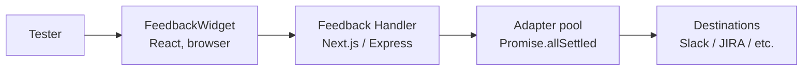

---

## 2. Three deployment modes

snapfeed supports three deployment topologies. The same `FeedbackPayload` and `FeedbackAdapter` interfaces apply across all three; only the trust boundaries change.

### 2.1 Cloud-relayed

The most common mode. The consumer's Next.js (or Express) app is hosted on Vercel/Netlify/Cloudflare. The widget bundle ships as part of the consumer's app. POSTs go same-origin to `/api/feedback`, which runs `createFeedbackHandler` (`src/server/nextjs.ts:52`) inside the same serverless function. Adapters call out to external APIs.

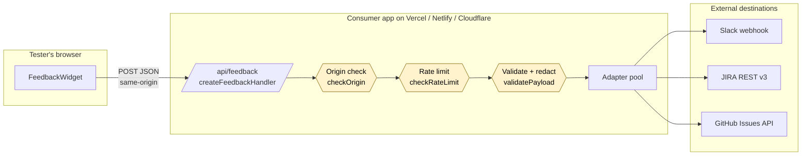

Trust boundaries: the **browser → edge** crossing is enforced by `checkOrigin`, `checkRateLimit`, and `validatePayload`. The **edge → external** crossing carries adapter-specific request bodies (signed by the consumer's stored secrets — never in the browser).

### 2.2 Self-hosted (Docker Compose)

Run snapfeed entirely inside the consumer's infrastructure. The `docker/docker-compose.yml` stack ships a worker container, MinIO for object storage, and an optional Ollama container for in-tenant LLM inference.

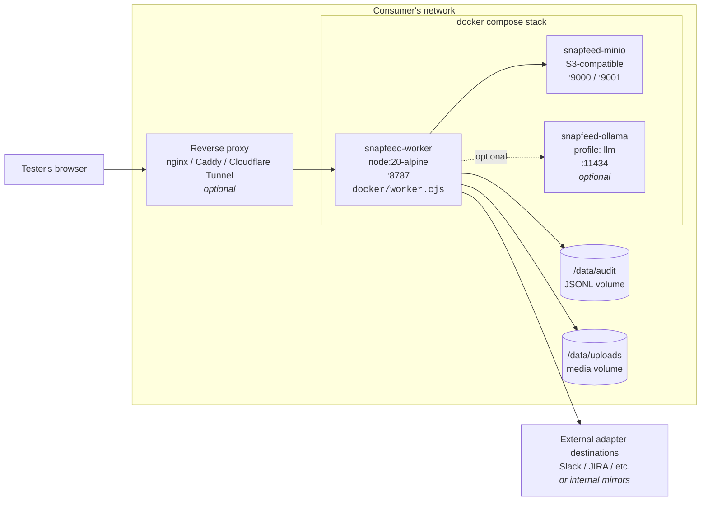

Notes from `docker/docker-compose.yml`:

- The worker exposes `GET /healthz` and `POST /feedback` (`docker/worker.cjs:197`, `:214`).
- MinIO is `depends_on: service_healthy` for the worker.
- Ollama is gated behind the `llm` Compose profile — opt in with `docker compose --profile llm up`.
- Postgres is **not** included in v0.5; feedback lands in the JSONL audit log and uploaded media in the on-disk store. v0.6 will add a Postgres-backed inbox.

### 2.3 Air-gapped (Corp VPC)

Everything inside the corporate VPC. No outbound DNS to public networks. LLM inference is in-tenant (Bedrock private endpoint, Azure OpenAI private endpoint, or Ollama). Audit log forwarded to SIEM.

```mermaid
flowchart TB
    subgraph VPC [Corp VPC – no public egress]
        Tester[Tester's browser]

        subgraph DMZ [Internal DMZ]
            ILB[Internal load balancer]
        end

        subgraph K8s [Kubernetes cluster]
            P1[snapfeed worker pod 1]
            P2[snapfeed worker pod 2]
            P3[snapfeed worker pod 3]
            FB[Fluent Bit sidecar<br/>tails audit JSONL]
        end

        subgraph Data [Data services – in-tenant]
            PG[(Internal Postgres<br/>status sidecar<br/><b>v0.6 — TODO</b>)]
            S3[(Internal S3 / MinIO<br/>media)]
        end

        subgraph LLM [In-tenant LLM]
            BR[AWS Bedrock<br/>VPC endpoint]
            AZ[Azure OpenAI<br/>private endpoint]
            OL[Self-hosted<br/>Ollama]
        end

        SIEM[(SIEM<br/>Splunk / Elastic)]

        subgraph Dest [Internal-only adapter destinations]
            MM[Mattermost]
            GL[GitLab Issues]
            SN[ServiceNow]
            AC[Atlassian Cloud<br/>Private Link]
        end
    end

    Tester --> ILB
    ILB --> P1 & P2 & P3
    P1 & P2 & P3 --> S3
    P1 & P2 & P3 -.v0.6.-> PG
    P1 & P2 & P3 --> BR
    P1 & P2 & P3 --> AZ
    P1 & P2 & P3 --> OL
    FB --> SIEM
    P1 & P2 & P3 --> MM & GL & SN & AC
```

The worker enforces no egress restrictions itself — that is the consumer's network-layer responsibility (security groups / VPC firewalls). See THREAT_MODEL.md residual risk #4.

---

## 3. Component / module map

The package is composed of fourteen independently-buildable entries (see `tsup.config.ts`). The diagram below colour-codes by runtime: **blue = browser-only**, **green = server-only**, **orange = isomorphic**.

```mermaid
flowchart TB
    subgraph Public [Public entry points - package.json exports]
        E1[snapfeed<br/>./]
        E2[snapfeed/adapters<br/>./adapters]
        E3[snapfeed/server/nextjs<br/>./server/nextjs]
        E4[snapfeed/server/express<br/>./server/express]
        E5[snapfeed/routing<br/>./routing]
        E6[snapfeed/routing-sources<br/>./routing-sources]
        E7[snapfeed/llm<br/>./llm]
        E8[snapfeed/voice<br/>./voice]
        E9[snapfeed/screen-recording<br/>./screen-recording]
        E10[snapfeed/storage<br/>./storage]
        E11[snapfeed/audit-log<br/>./audit-log]
        E12[snapfeed/network-capture<br/>./network-capture]
        E13[snapfeed/campaigns<br/>./campaigns]
        E14[snapfeed-cli<br/>bin: snapfeed]
    end

    subgraph Components [React components - browser]
        FP[FeedbackProvider<br/>src/FeedbackProvider.tsx]
        FW[FeedbackWidget<br/>src/FeedbackWidget.tsx]
        FB[FeedbackButton]
        FI[FeedbackInbox]
        AC[AnnotationCanvas]
        UDF[useDevFeedback hook]
    end

    subgraph Server [Server modules]
        NJ[server/nextjs.ts<br/>createFeedbackHandler]
        EX[server/express.ts<br/>feedbackMiddleware]
        SEC[server/security.ts<br/>checkOrigin / checkRateLimit /<br/>validatePayload / sanitizeConsoleError]
    end

    subgraph Iso [Isomorphic primitives]
        ROUT[routing.ts<br/>defineRouting / resolveRoute /<br/>matchUrl / mergeDestinations]
        CMP[campaigns.ts<br/>defineCampaign / isCampaignActive]
        TYP[types.ts<br/>FeedbackPayload / FeedbackAdapter / ...]
    end

    subgraph Adapters [Adapter implementations - server]
        ADAPT[adapters/index.ts<br/>console / webhook / slack / discord /<br/>telegram / supabase / github / file /<br/>jira / linear / googleSheets /<br/>msTeams / asana / clickUp / notion]
        AUTO[adapters/auto.ts<br/>autoAdapters from env vars]
    end

    subgraph LLMmod [LLM runner - server]
        LLM[llm/index.ts<br/>applyLLM]
        REDACT[llm/redact.ts<br/>redactForLLM]
        BUD[llm/budget.ts<br/>BudgetTracker]
        PROV[llm/providers/<br/>anthropic / openai / ollama]
    end

    subgraph Browser [Browser-only utilities]
        VOICE[voice.ts]
        SR[screen-recording.ts]
        NC[network-capture.ts]
        SS[screenshot.ts<br/>html2canvas wrapper]
    end

    subgraph Persistence [Server persistence]
        AUD[audit-log.ts<br/>fileAuditLog / multi / noop]
        STO[storage/index.ts<br/>fileStorage / s3Storage]
    end

    subgraph RoutingSources [Routing sources - server]
        RST[routing-sources/types.ts<br/>cacheRoutingSource]
    end

    E1 --> FP & FW & FB & FI & AC & UDF & TYP & ROUT & CMP
    E2 --> ADAPT & AUTO
    E3 --> NJ
    E4 --> EX
    E5 --> ROUT
    E6 --> RST
    E7 --> LLM & REDACT & BUD & PROV
    E8 --> VOICE
    E9 --> SR
    E10 --> STO
    E11 --> AUD
    E12 --> NC
    E13 --> CMP
    E14 -.scaffolds.-> NJ & EX

    FP --> FW
    FW --> SS
    NJ --> SEC
    EX --> SEC
    ADAPT --> TYP
    LLM --> REDACT & BUD & PROV
    RST --> ROUT
    AUTO --> ADAPT

    classDef browser fill:#cfe2ff,stroke:#0a58ca,color:#000
    classDef server fill:#d1e7dd,stroke:#146c43,color:#000
    classDef iso fill:#ffe5b4,stroke:#b25f00,color:#000

    class FP,FW,FB,FI,AC,UDF,VOICE,SR,NC,SS browser
    class NJ,EX,SEC,ADAPT,AUTO,LLM,REDACT,BUD,PROV,AUD,STO,RST,E14 server
    class ROUT,CMP,TYP,E1,E5,E6,E13 iso
```

The `snapfeed` main entry re-exports a curated subset of the others (see `src/index.ts:1-77`) so the common case is a single import.

---

## 4. Data flow — single feedback submission

This is the canonical happy-path sequence for one feedback submission, from hotkey-press to toast.

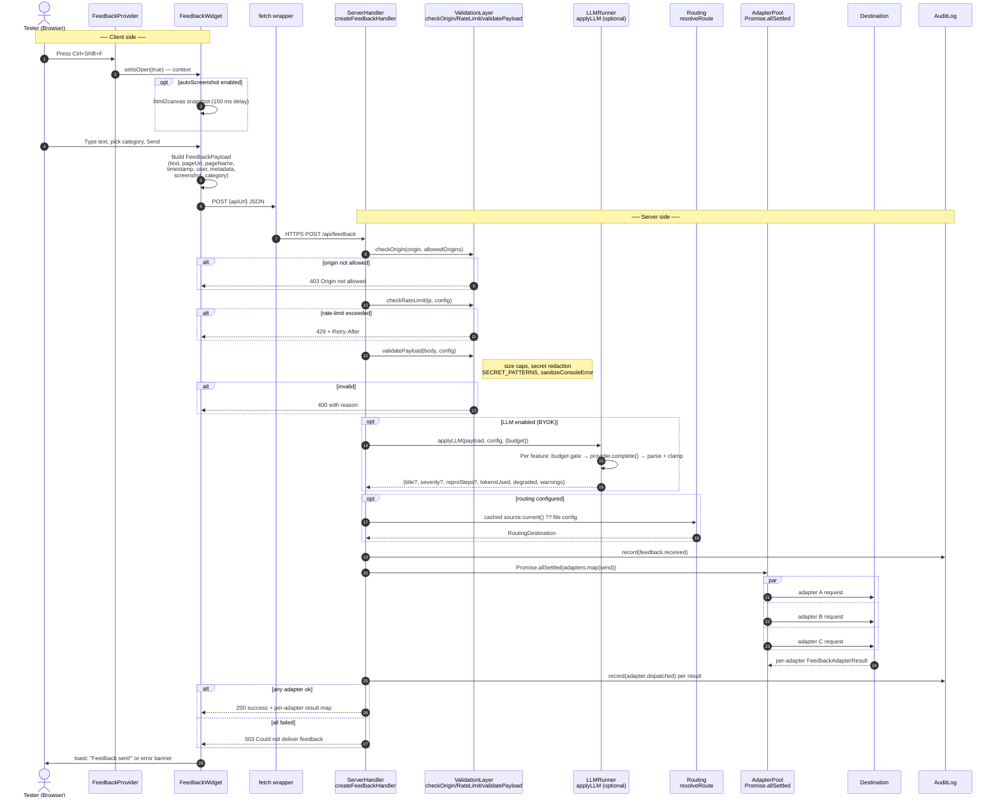

**Steps that can be skipped:**

- **3** — `autoScreenshot: false` (the v0.4 default) skips html2canvas entirely.
- **Voice / screen-recording** — opt-in via `snapfeed/voice` and `snapfeed/screen-recording`; not in the default widget flow.
- **LLM (step group around `applyLLM`)** — when `config.enabled === false` (the default), `applyLLM` returns immediately (`src/llm/index.ts:91`).
- **Routing** — when no routing source is configured, the handler simply runs every adapter in `config.adapters` for every payload.

---

## 5. Trust boundaries

snapfeed maintainers are not in any trust boundary — there is no relay (THREAT_MODEL.md, "Trust boundaries"). The diagram below shows what flows across each boundary.

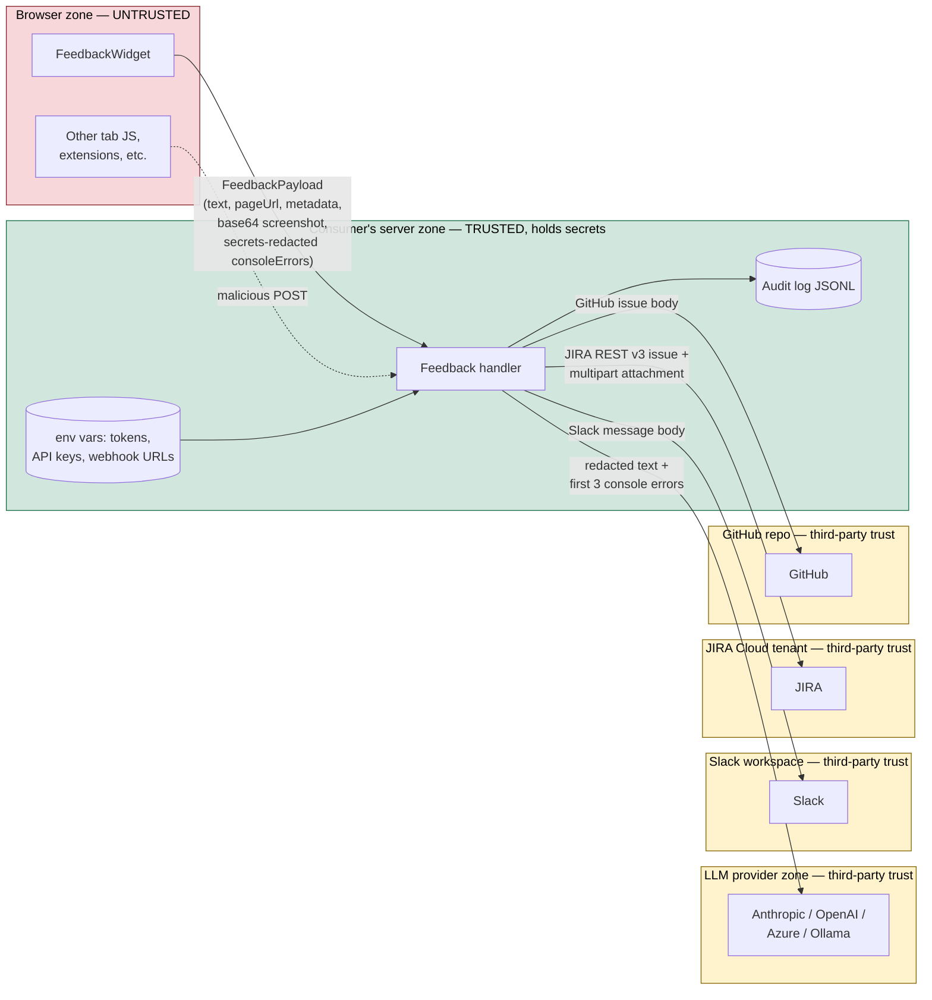

Concrete observations:

- The browser → server payload is the **only** untrusted input the handler accepts. Everything else (env vars, file config, cached routing source) is operator-provided.
- `validatePayload` in `src/server/security.ts:94` is the choke point for size, type, and secret-pattern checks.
- The LLM zone sees only redacted text (when `redactBeforeLLM: true`, `src/llm/index.ts:104`) plus the first three console errors. Never the screenshot, never the full payload.
- Each destination zone receives an adapter-specific request crafted server-side; tokens never leave the trusted zone.

---

## 6. Threat surface map

Numbers reference the threat table in [THREAT_MODEL.md § "Top threats and mitigations (v0.4)"](../THREAT_MODEL.md#top-threats-and-mitigations-v04).

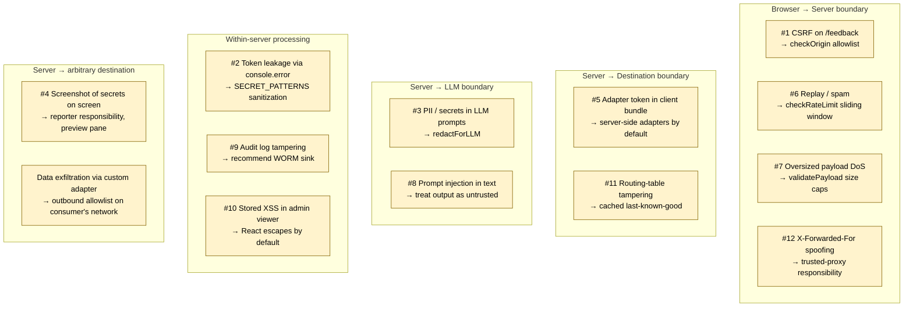

For each threat, mitigation source files are cited inline in THREAT_MODEL.md. The trust-boundary diagram (§ 5) shows which boundary each threat crosses.

---

## 7. State machine — widget lifecycle

The widget is a single React component (`src/FeedbackWidget.tsx`) driven by the `isOpen` flag plus four local UI states. Voice and screen-recording, when enabled, run as parallel sub-states attached to the `open` state.

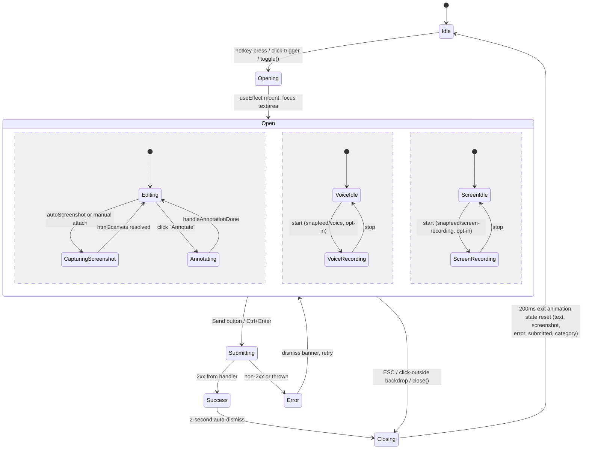

Key implementation points:

- Hotkey toggle: `src/FeedbackProvider.tsx:128-135`.
- Screenshot capture is debounced 150 ms so the modal doesn't appear in the snapshot: `src/FeedbackWidget.tsx:142`.
- ESC + Ctrl+Enter handlers: `src/FeedbackWidget.tsx:193-200`.
- State reset on close (200 ms exit): `src/FeedbackWidget.tsx:158-172`.

---

## 8. Adapter contract

Every adapter — shipped or third-party — implements one interface. This is the single most important contract for community contributors.

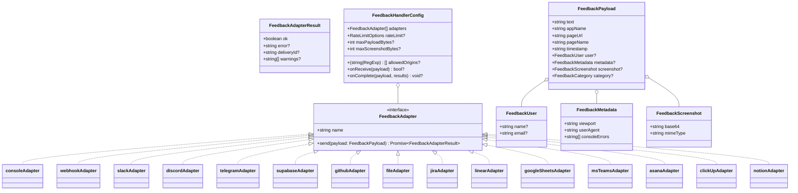

Definitions live in `src/types.ts` (interfaces) and `src/adapters/*.ts` (implementations). `jiraAdapter` (`src/adapters/jira.ts:208`) is a representative server-side adapter — it builds an Atlassian Document Format body, POSTs it to `/rest/api/3/issue`, then optionally uploads the screenshot as a multipart attachment. The screenshot upload is best-effort; failure surfaces as a `console.warn` rather than failing the whole `send()`.

---

## 9. Routing resolution

Routing is **two-tier**:

- **Tier 1**: a static `RoutingConfig` you import (`defineRouting({...})`, `src/routing.ts:67`). Compiled into the bundle. Edit + redeploy.
- **Tier 2**: a `RoutingSource` (CSV, Google Sheets, Notion, etc.) wrapped in `cacheRoutingSource` (`src/routing-sources/types.ts:72`). Polled in the background, cached in memory, falls back to last-known-good on transient failure.

```mermaid
flowchart LR
    P[Receive payload]
    Q{Tier 2 source<br/>configured?}
    C[cachedSource.current]
    F[Tier 1 file config]
    W[Walk routes &#91;&#93; in order]
    R{Rule matches?<br/>match URL glob<br/>AND flag in metadata.flags<br/>AND category equals}
    M[Use rule.to]
    D[Use config.default ?? &#123;&#125;]
    DEST[RoutingDestination<br/>team, slack, jira, linear,<br/>github, discord, sheet,<br/>assignee, labels]
    DISP[Consumer dispatches<br/>to relevant adapters]

    P --> Q
    Q -- yes --> C --> W
    Q -- no --> F --> W
    W --> R
    R -- yes, first match wins --> M --> DEST
    R -- no rules matched --> D --> DEST
    DEST --> DISP
```

Important behavioural details from `src/routing.ts:103-141`:

- All present conditions on a rule are **AND**ed (a rule with `match` + `flag` + `category` requires all three).
- The **first** matching rule wins — no merging across multiple matches. Use `mergeDestinations` (`src/routing.ts:117`) explicitly if you want overlay behaviour.
- `*` matches a single path segment; `**` matches any depth (`src/routing.ts:157-173`).
- `cacheRoutingSource` polls every 5 minutes by default; the interval is `unref()`'d so it never keeps the Node process alive (`src/routing-sources/types.ts:109`).

---

## 10. LLM execution flow

The LLM runner is **fully opt-in** and **never throws**. Every feature degrades independently — one feature failing leaves the others alive and surfaces a `warnings[]` entry on the result.

```mermaid
flowchart TB
    A[applyLLM payload, config, options]
    B{enabled?}
    Z1[return empty result]
    C{any feature true?<br/>title / severity / repro / redact}
    P[createProvider config]
    Q{provider null?}
    Z2[push warning 'no_provider'<br/>return]
    R{redactBeforeLLM?}
    R1[redactForLLM text<br/>+ console errors]
    R2[use raw text]

    F1{feature.title?}
    F2{feature.severity?}
    F3{feature.repro?}

    BG1{budget.allow<br/>ESTIMATED_MAX_TOKENS_PER_CALL?}
    BG2{budget.allow ...?}
    BG3{budget.allow ...?}

    SK1[push warning<br/>'title: skipped<br/>budget exhausted']
    SK2[push warning 'severity: skipped'<br/>budget exhausted]
    SK3[push warning 'repro: skipped'<br/>budget exhausted]

    P1[provider.complete<br/>system+user, maxTokens=64]
    P2[provider.complete<br/>maxTokens=16]
    P3[provider.complete<br/>maxTokens=256]

    PR1[parse + trim title<br/>budget.record tokensUsed]
    PR2[parseSeverity → p0/p1/p2/nit]
    PR3[parseSteps → string&#91;&#93;]

    ER[catch err →<br/>pushWarning describeError<br/>continue with other features]

    AGG[Aggregate LLMRunResult<br/>title, severity, reproSteps,<br/>tokensUsed, degraded, warnings]

    A --> B
    B -- false --> Z1
    B -- true --> C
    C -- no --> Z1
    C -- yes --> P --> Q
    Q -- yes --> Z2
    Q -- no --> R
    R -- true --> R1 --> F1
    R -- false --> R2 --> F1

    F1 -- yes --> BG1
    BG1 -- no --> SK1 --> F2
    BG1 -- yes --> P1 --> PR1 --> F2
    P1 -.throw.-> ER --> F2

    F2 -- yes --> BG2
    BG2 -- no --> SK2 --> F3
    BG2 -- yes --> P2 --> PR2 --> F3
    P2 -.throw.-> ER

    F3 -- yes --> BG3
    BG3 -- no --> SK3 --> AGG
    BG3 -- yes --> P3 --> PR3 --> AGG
    P3 -.throw.-> ER

    F1 -- no --> F2
    F2 -- no --> F3
    F3 -- no --> AGG
```

Key contracts (`src/llm/index.ts:1-15`, `:80-209`):

1. **Opt-in.** `enabled: false` → no LLM call, ever.
2. **BYOK.** snapfeed never sees an API key in transit; consumers configure providers (`anthropicProvider`, `openaiProvider`, `ollamaProvider`).
3. **Token budget checked BEFORE each call.** Fails closed when exceeded.
4. **Pre-LLM redaction** is opt-in (`config.redactBeforeLLM`), backed by `redactForLLM` regex + entropy heuristics.
5. **Each feature degrades independently.** The result carries `degraded: true` plus `warnings[]` so the caller can render "delivered, title generation skipped: budget exhausted".

`bedrock` and `custom` providers are reserved but not implemented in this release — `createProvider` returns `null` and the runner pushes a `no_provider` warning rather than throwing (`src/llm/index.ts:62-68`).

---

## 11. Build & packaging architecture

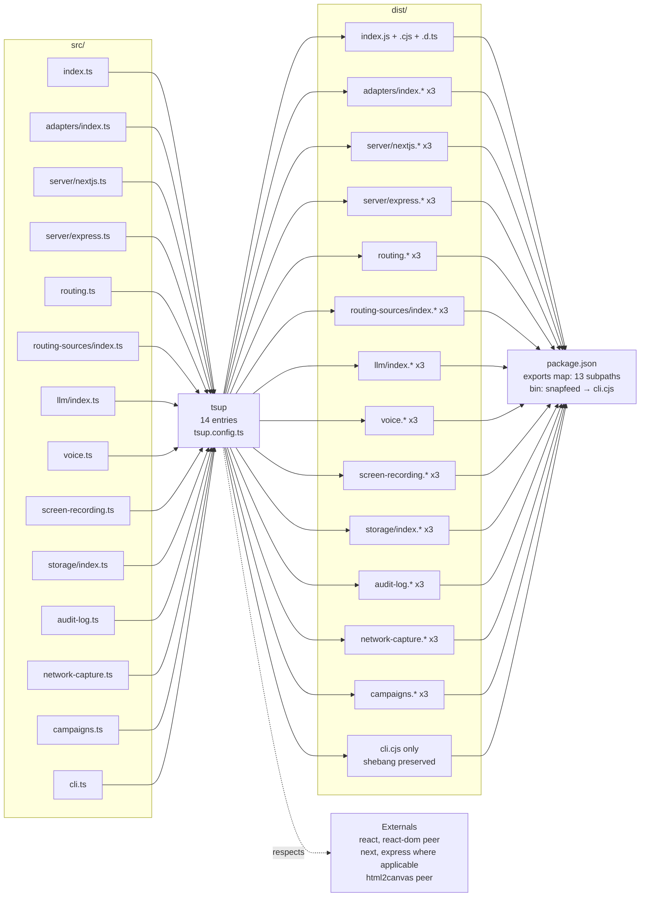

- All 13 library entries emit ESM + CJS + `.d.ts`. The CLI emits CJS only with the `#!/usr/bin/env node` shebang preserved (no banner injected — `tsup.config.ts:60-71`).
- `react` and `react-dom` are externals everywhere (peer dependencies). `next`, `express`, and `@supabase/supabase-js` are externals for the entries that touch them.
- `splitting: false` and `treeshake: true` give clean per-entry bundles without shared chunks.

---

## 12. Test pyramid

The repo ships **41 test files** containing **~396 individual test cases** (counted via `it(` / `test(` declarations across `tests/`).

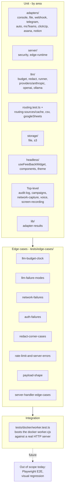

Run the full suite with `npm test`. On Node 25, use `npm test -- --reporter=basic` (the default `default` reporter currently misbehaves under Node 25's experimental ESM hooks).

---

## 13. Deployment topology — concrete production example

A realistic mid-size team running snapfeed on Vercel:

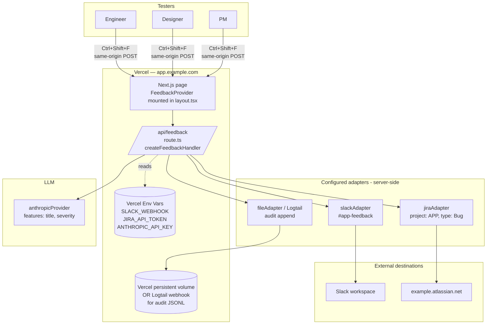

Notes for this topology:

- Screenshots stay as base64 inside the JSON body (small enough — capped at 5 MB by `validatePayload`).
- For larger media, swap in `s3Storage` from `snapfeed/storage` and have a custom adapter wrap it.
- The audit JSONL on Vercel is best persisted to an external log sink (Logtail, Datadog, S3 via Vercel Blob) since Vercel functions are stateless.

---

## 14. Security architecture summary

Every defense in v0.4, with the file:line where it lives.

1. **Origin allowlist** — `checkOrigin(origin, config.allowedOrigins)` in `src/server/security.ts:158`. Returns `true` if no allowlist set; otherwise checks string-equal or `RegExp.test`. Rejects with **403** at handler edge (`src/server/nextjs.ts:66`, `src/server/express.ts:68`).
2. **Rate limiter** — `checkRateLimit(ip, config)` in `src/server/security.ts:69`, backed by `defaultRateLimitStore` (`src/server/security.ts:45`). Default 10 req/min per IP, sliding window, in-memory; consumers can swap in a Redis/Upstash store via `RateLimitStore` (`src/types.ts:223`). Returns **429** with `Retry-After` header.
3. **Payload size caps** — `validatePayload` in `src/server/security.ts:94`. Hard 64,000-character cap on `text`; configurable `maxPayloadBytes` (default 10 KB) for text+metadata; configurable `maxScreenshotBytes` (default 5 MB). Rejects with **400**.
4. **Console error redaction** — `SECRET_PATTERNS` + `sanitizeConsoleError` in `src/server/security.ts:190-207`. Strips `token=…`, `key=…`, `secret=…`, `password=…`, `bearer …`, `authorization=…`, and JWT-shape strings before any adapter sees the payload.
5. **LLM pre-redaction** — `redactForLLM` in `src/llm/redact.ts`, applied when `config.redactBeforeLLM === true` at `src/llm/index.ts:104`. Strips emails, credit-card-shape digits, JWTs, and high-entropy tokens.
6. **Production-disable rail** — `enableInProduction: false` is the default in `src/FeedbackProvider.tsx:95`. The provider returns `<>{children}</>` with no widget mounted unless the consumer explicitly opts in or runs on `localhost`.
7. **Audit log** — `fileAuditLog` in `src/audit-log.ts:93` appends every `feedback.received`, `adapter.dispatched`, `llm.called`, `config.changed`, and `rate_limit.hit` event as a JSONL line. `hashReporter: true` truncates SHA-256 to 12 chars for off-host shipping. `multiAuditLog` (`src/audit-log.ts:129`) fans out to multiple sinks; failures in one sink never break the request flow.
8. **BYOK LLM** — provider definitions in `src/llm/types.ts` and `src/llm/providers/*`; the API key never proxies through snapfeed-controlled infrastructure (snapfeed runs no infrastructure).

Cross-references: `THREAT_MODEL.md` rows 1–12 map onto these defenses.

---

## 15. Bundle size budget

Budgets enforced in CI by `size-limit` against `.size-limit.cjs`. Sizes below were measured against the current `dist/` (the `.size-limit.cjs` baseline expects `dist/index.mjs`-style file names; `tsup` actually emits `dist/index.js` for ESM, so the `npm run size` invocation runs against the live tsup output).

| Subpath                     | Current (gzip) | Budget | Headroom |
|-----------------------------|----------------|--------|----------|
| `snapfeed`                  | ~30 KB         | 60 KB  | ~50 %    |
| `snapfeed/adapters`         | ~12 KB         | 40 KB  | ~70 %    |
| `snapfeed/routing`          | <1 KB          | 5 KB   | ~85 %    |
| `snapfeed/campaigns`        | <1 KB          | 5 KB   | ~85 %    |
| `snapfeed/voice`            | ~1.8 KB        | 5 KB   | ~64 %    |
| `snapfeed/screen-recording` | ~1.6 KB        | 5 KB   | ~68 %    |
| `snapfeed/network-capture`  | ~1.5 KB        | 5 KB   | ~70 %    |
| `snapfeed/llm`              | ~3.1 KB        | 20 KB  | ~85 %    |

Budgets are intentionally ~2× current sizes — enough headroom for legitimate growth, narrow enough to catch a runaway regression (accidental React bundling into adapters, broken tree-shaking, etc.). Re-baseline by running `npm run size` and updating the limits in `.size-limit.cjs`.

---

## 16. Versioning model

snapfeed follows [Semantic Versioning 2.0.0](https://semver.org/spec/v2.0.0.html). While on `0.x`, **minor versions may contain breaking changes** (called out explicitly in `CHANGELOG.md`). Patch versions are bug-fix-only. See `VERSIONING.md` for the full policy.

The public API surface is everything reachable from these subpath exports:

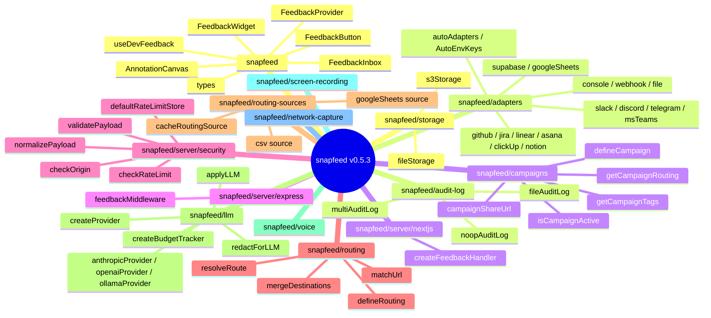

Anything not reachable via one of these subpaths is internal and may change without a major bump.

---

## 17. Future architecture (v0.5+ direction)

These are signalled directions, not commitments. Each is a small change to the diagrams above.

### 17.1 Postgres-backed inbox (replaces JSONL sidecar)

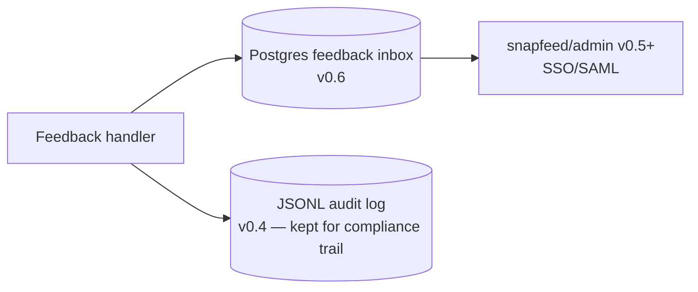

### 17.2 Admin app extracted as separate package

```mermaid
flowchart LR
    Core[snapfeed core]
    Admin[@snapfeed/admin<br/>separate npm package]
    Headless[@snapfeed/core<br/>headless UI primitives<br/>Vue / Svelte ports build on this]

    Core --> Admin
    Core --> Headless
```

### 17.3 Plugin marketplace pattern

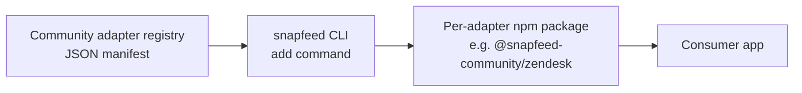

### 17.4 Image-digest pinning + signed releases

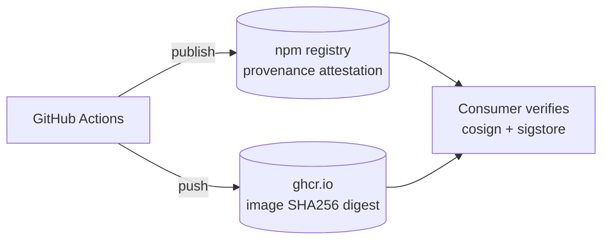

---

## 18. Glossary

- **Adapter** — a small server-side module that delivers a `FeedbackPayload` to one specific destination. Implements `FeedbackAdapter` (`name`, `send`).
- **Audit log** — the append-only JSONL stream of `feedback.received`, `adapter.dispatched`, `llm.called`, `config.changed`, and `rate_limit.hit` events. Default sink is `fileAuditLog`; consumers can swap in any `AuditLog` implementation.
- **BYOK** — Bring Your Own Key. The consumer holds the LLM provider's API key in their own env vars; snapfeed never proxies it.
- **Fan-out** — the parallel dispatch of a single payload to all configured adapters, executed via `Promise.allSettled` so one failing adapter does not block the others.
- **In-tenant LLM** — an LLM endpoint inside the consumer's network boundary (Bedrock VPC endpoint, Azure OpenAI private endpoint, self-hosted Ollama). Required for air-gapped deployments.
- **Ingress** — the entry point into the deployment that terminates TLS and applies the trusted proxy's `X-Forwarded-For` header. snapfeed trusts whatever IP its host runtime gives it; the consumer must control the ingress.
- **Ring buffer** — fixed-size FIFO buffer used by `network-capture` (`maxRequests`, default 20) and the console-error capturer (`MAX_CONSOLE_ERRORS = 20`) so memory cost is bounded.
- **Routing source** — a `RoutingSource` (Tier 2) is a backend that returns a `RoutingConfig` shape on demand: a CSV file, a Google Sheet, a future Postgres table, etc. `cacheRoutingSource` polls one and exposes the last-known-good synchronously.
- **Sidecar** — a co-located process or container that handles cross-cutting concerns (audit forwarding via Fluent Bit, TLS termination via a reverse proxy). Used in the air-gapped diagram.
- **Swarm** — the parallel cluster of `Promise.allSettled`-orchestrated adapter sends within a single request; not Docker Swarm.
- **Trust boundary** — a line in the architecture across which data must be validated, redacted, or signed. The four boundaries in snapfeed are: Browser ↔ Server, Server ↔ LLM, Server ↔ Destination, and Server ↔ Audit sink.
- **WORM** — Write-Once-Read-Many storage (e.g. an S3 bucket with object lock). Recommended by THREAT_MODEL.md row #9 as the production-grade target for the audit log.
