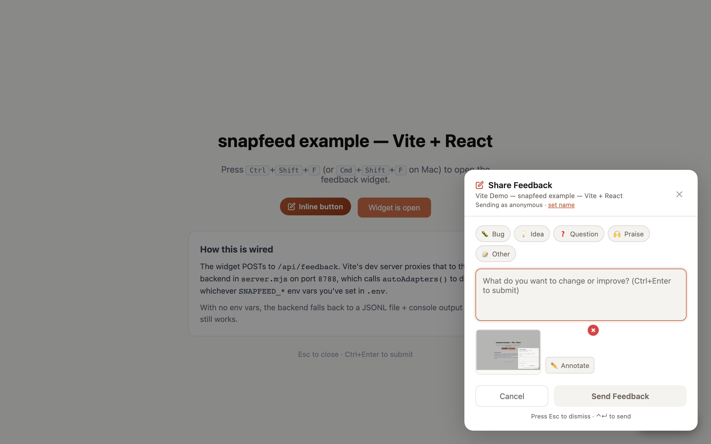

# Customization

> Theme tokens import from `snapfeed/theme` (subpath form). The same exports are also re-exported from the main `snapfeed` barrel for convenience.

snapfeed ships with a polished default widget — drop in `<FeedbackProvider>` and you have a working feedback flow. But every product has its own design language, and the widget should look like *yours*, not ours.



> The default modal as it appears out of the box (`accentColor: "#B85A36"`, `theme: "auto"`). Levels 1–4 below show how to peel back any layer of this.

This guide walks through four levels of customization, ordered from "5-minute rebrand" to "render anything you want."

## The four levels at a glance

| Level | What you change | Effort | Use when |
|---|---|---|---|
| 1. Theme tokens | Colors, radii, spacing via CSS variables | ~5 min | You want to match brand colors and corner-radius |
| 2. Compound components | Compose `<FeedbackTrigger>`, `<FeedbackModal>`, `<FeedbackTextarea>` yourself | ~30 min | You want a different layout or different surfaces |
| 3. Slot swap | Replace one piece (e.g. textarea) with your own component | ~15 min per slot | You have a design system and want to reuse its components |
| 4. Headless / render-prop | We give you state; you render the entire UI | open-ended | You want full control or a non-modal layout (drawer, inline panel) |

You can mix-and-match. Most teams stop at Level 1; the rest are there when you need them.

---

## Level 1: Theme via CSS variables

The default widget reads its colors and spacing from CSS custom properties under the `--snapfeed-*` namespace. Override them in your stylesheet — no React changes needed.

```css
/* your-app.css */
:root {
  --snapfeed-color-accent: #6366F1;          /* your brand purple */
  --snapfeed-color-accent-foreground: #fff;
  --snapfeed-radius-md: 12px;
  --snapfeed-font-body: 'Inter', system-ui, sans-serif;
}
```

Or generate the rule from a `SnapfeedTheme` object using the `themeToCss` helper:

```ts
import { extendTheme, lightTheme, themeToCss } from 'snapfeed/theme'

const myTheme = extendTheme(lightTheme, {
  colors: { accent: '#6366F1' },
  radii: { md: '12px' },
})

document.head.insertAdjacentHTML(
  'beforeend',
  `<style>${themeToCss(myTheme)}</style>`,
)
```

Or scope the override to a subtree:

```ts
themeToCss(myTheme, '.feedback-zone')
// → ".feedback-zone { --snapfeed-color-accent: #6366F1; ... }"
```

### Available tokens

```ts
interface SnapfeedTheme {
  colors:    { accent, accentForeground, background, foreground,
               muted, border, surface, danger, warning, success }
  radii:     { sm, md, lg, pill }
  spacing:   { xs, sm, md, lg, xl }
  fonts:     { body, mono }
  fontSizes: { xs, sm, md, lg, xl }
  shadows:   { sm, md, lg }
  zIndex:    { trigger, modal, toast }
  motion:    { durationFast, durationMed, easing, reducedMotion }
}
```

Each token maps to one CSS variable. For example:

| Token | CSS variable |
|---|---|
| `colors.accent` | `--snapfeed-color-accent` |
| `radii.md` | `--snapfeed-radius-md` |
| `spacing.lg` | `--snapfeed-spacing-lg` |
| `shadows.md` | `--snapfeed-shadow-md` |
| `zIndex.modal` | `--snapfeed-z-modal` |
| `motion.durationFast` | `--snapfeed-duration-fast` |

`motion.reducedMotion` is metadata, not a CSS variable.

---

## Level 2: Compound components

For more layout control, import primitives from `snapfeed/headless` and compose them yourself. Each one is styleable via `className` and `style`, and reads its data from a parent `<FeedbackProvider>`.

```tsx
import { FeedbackProvider } from 'snapfeed'
import {
  FeedbackRoot,
  FeedbackTrigger,
  FeedbackModal,
  FeedbackCategorySelect,
  FeedbackTextarea,
  FeedbackScreenshotPreview,
  FeedbackError,
  FeedbackSuccess,
  FeedbackSubmitButton,
} from 'snapfeed/headless'

export function MyFeedbackUI() {
  return (
    <FeedbackProvider appName="Acme">
      <FeedbackRoot className="my-feedback">
        <FeedbackTrigger>Send feedback</FeedbackTrigger>

        <FeedbackModal>
          <h2>How can we improve?</h2>
          <FeedbackCategorySelect />
          <FeedbackTextarea placeholder="Tell us more…" autoFocus />
          <FeedbackScreenshotPreview />
          <FeedbackError />
          <FeedbackSuccess />
          <FeedbackSubmitButton />
        </FeedbackModal>
      </FeedbackRoot>
    </FeedbackProvider>
  )
}
```

`FeedbackTrigger` supports the Radix-style `asChild` pattern when you want to use your existing button:

```tsx
<FeedbackTrigger asChild>
  <YourButton variant="primary">Send feedback</YourButton>
</FeedbackTrigger>
```

---

## Level 3: Swap individual components

If you only want to replace one piece — say, swap the textarea for a rich editor while keeping everything else — wrap your tree in `<FeedbackComponentsProvider>`.

```tsx
import { FeedbackComponentsProvider } from 'snapfeed/headless'
import { Tiptap } from './my-tiptap'

function RichTextarea({
  value,
  onChange,
  placeholder,
}: {
  value: string
  onChange: (v: string) => void
  placeholder?: string
}) {
  return <Tiptap content={value} onUpdate={onChange} placeholder={placeholder} />
}

<FeedbackProvider>
  <FeedbackComponentsProvider components={{ Textarea: RichTextarea }}>
    <FeedbackTrigger>Send feedback</FeedbackTrigger>
    <FeedbackModal>
      <FeedbackTextarea placeholder="…" />  {/* now renders <Tiptap> */}
      <FeedbackSubmitButton />
    </FeedbackModal>
  </FeedbackComponentsProvider>
</FeedbackProvider>
```

You can swap `Trigger`, `Modal`, `Textarea`, `CategoryChip`, and `SubmitButton`. Anything you don't supply falls back to the built-in.

---

## Level 4: Headless / render-prop

Want a totally different shell — a Slack-style sidebar, an inline panel, a chat bubble? `<FeedbackHeadless>` gives you the same state object the components use, and lets you render whatever you want.

```tsx
import { FeedbackHeadless } from 'snapfeed/headless'

<FeedbackProvider appName="Acme">
  <FeedbackHeadless>
    {({ state, open, close, form, submit, error }) => (
      <aside className="my-drawer" data-open={state === 'open'}>
        <button onClick={open}>Send feedback</button>

        {state !== 'idle' && (
          <form
            onSubmit={e => {
              e.preventDefault()
              submit().catch(() => undefined)
            }}
          >
            <textarea
              value={form.text}
              onChange={e => form.setText(e.target.value)}
            />
            {error && <p className="error">{error.message}</p>}
            <button type="submit" disabled={state === 'submitting'}>
              {state === 'submitting' ? 'Sending…' : 'Send'}
            </button>
            <button type="button" onClick={close}>
              Cancel
            </button>
          </form>
        )}
      </aside>
    )}
  </FeedbackHeadless>
</FeedbackProvider>
```

Or use the underlying hook directly:

```ts
import { useFeedbackWidget } from 'snapfeed/headless'

function MyFeedback() {
  const { state, open, form, submit } = useFeedbackWidget()
  // ...
}
```

---

## Match your design system

### Tailwind

Apply your Tailwind classes via `className`. The compound components forward `className` to the root element of each piece.

```tsx
<FeedbackModal className="rounded-2xl shadow-xl bg-white dark:bg-slate-900">
  <FeedbackTextarea
    className="w-full rounded-md border border-slate-200 p-3 focus:ring-2 focus:ring-indigo-500"
    placeholder="What can we do better?"
  />
  <FeedbackSubmitButton className="mt-3 w-full rounded-md bg-indigo-600 text-white py-2 font-semibold hover:bg-indigo-700" />
</FeedbackModal>
```

### shadcn/ui

Use slot swaps to plug shadcn components straight in.

```tsx
import { Button, Textarea } from '@/components/ui'

<FeedbackComponentsProvider
  components={{
    Trigger: ({ onOpen, children }) => (
      <Button onClick={onOpen}>{children}</Button>
    ),
    Textarea: ({ value, onChange, placeholder }) => (
      <Textarea
        value={value}
        onChange={e => onChange(e.target.value)}
        placeholder={placeholder}
      />
    ),
    SubmitButton: ({ onClick, loading, disabled, children }) => (
      <Button onClick={onClick} disabled={disabled || loading}>
        {children}
      </Button>
    ),
  }}
>
  {/* …compound components here */}
</FeedbackComponentsProvider>
```

### Material UI

```tsx
import { Button, TextField, Dialog } from '@mui/material'

<FeedbackComponentsProvider
  components={{
    Trigger: ({ onOpen, children }) => (
      <Button variant="contained" onClick={onOpen}>{children}</Button>
    ),
    Modal: ({ onClose, children }) => (
      <Dialog open onClose={onClose}>{children}</Dialog>
    ),
    Textarea: ({ value, onChange, placeholder }) => (
      <TextField
        multiline rows={4} fullWidth
        value={value}
        onChange={e => onChange(e.target.value)}
        placeholder={placeholder}
      />
    ),
  }}
>
  {/* …compound components here */}
</FeedbackComponentsProvider>
```

---

## Branding the widget

The default `<FeedbackProvider>` accepts a few quick branding props that don't require a theme override:

```tsx
<FeedbackProvider
  appName="Acme"             // shown in the header + adapter notifications
  accentColor="#B85A36"      // primary CTA + focus rings (default; WCAG AA on white)
  hotkey="meta+shift+f"      // ⌘⇧F to open
  position="bottom-right"    // bottom-right | bottom-left | top-right | top-left
/>
```

For full theming (radii, spacing, fonts, shadows), use Level 1.

---

## Dark mode integration

snapfeed has three theme modes:

- `theme="light"` — always light
- `theme="dark"` — always dark
- `theme="auto"` (default) — follows `prefers-color-scheme`

If your app has its own dark-mode toggle (independent of the OS setting), wire it in by passing the resolved value:

```tsx
const isDark = useMyDarkMode()

<FeedbackProvider theme={isDark ? 'dark' : 'light'} />
```

If you're using Level 1 theming, you can also publish two scopes and let CSS pick:

```ts
import { lightTheme, darkTheme, themeToCss } from 'snapfeed/theme'

const css = `
  ${themeToCss(lightTheme)}
  @media (prefers-color-scheme: dark) {
    ${themeToCss(darkTheme)}
  }
`
```

---

## i18n

snapfeed does not ship localized strings yet. The recommended workaround is the slot-swap layer: provide your own components with translated copy, e.g.

```tsx
<FeedbackComponentsProvider
  components={{
    Trigger: ({ onOpen }) => (
      <button onClick={onOpen}>{t('feedback.open')}</button>
    ),
    SubmitButton: ({ onClick, loading, disabled }) => (
      <button onClick={onClick} disabled={disabled}>
        {loading ? t('feedback.sending') : t('feedback.send')}
      </button>
    ),
  }}
>
  <FeedbackTrigger />
  <FeedbackModal>
    <FeedbackTextarea placeholder={t('feedback.placeholder')} />
    <FeedbackSubmitButton />
  </FeedbackModal>
</FeedbackComponentsProvider>
```

A first-class i18n layer (with a `messages` config and built-in locales) is on the roadmap.
